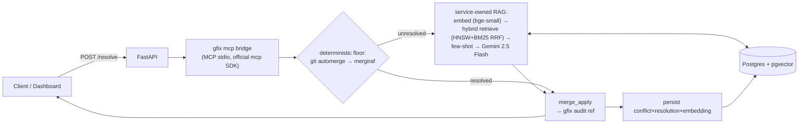

# gfix-cloud

gfix-cloud is a service that wraps the [gfix](https://github.com/ameyypawar/gfix)
merge-conflict engine behind an API and adds a retrieval-augmented layer over
its *own* growing corpus of past resolutions: conflicts are embedded and
stored in Postgres/pgvector, similar past resolutions are retrieved via
hybrid search, and — for the conflicts a deterministic floor (git automerge,
then [mergiraf](https://codeberg.org/mergiraf/mergiraf)) can't resolve — a
few-shot-augmented Gemini call proposes a resolution. A Next.js dashboard
gives an interactive view of the pipeline and the eval results.

Stack in one line: **FastAPI + Postgres/pgvector (HNSW+BM25 hybrid search) +
local sentence-transformers embeddings + MCP bridge to `gfix` + mergiraf
deterministic floor + Gemini generation + Next.js dashboard, all in one
`docker compose up`.**

## Architecture



Full diagram + stage-by-stage walkthrough (trust artifacts, keyless-graceful
path): [`docs/architecture.md`](docs/architecture.md).

## Quickstart

```bash
cp .env.example .env      # optional: set GEMINI_API_KEY for AI suggestions
docker compose up
```

Open `http://localhost:3000`.

Works **keyless** out of the box: the deterministic floor (git automerge +
mergiraf) and retrieval both run with zero API keys. Set `GEMINI_API_KEY` in
`.env` before `docker compose up` to enable AI-generated suggestions on the
conflicts the deterministic floor can't resolve.

<!-- dashboard screenshot added post-deploy -->

## How it works

1. `POST /resolve {base, ours, theirs, file_path, rag}` materializes a
   scratch git repo and drives `gfix mcp` (via the official `mcp` Python
   SDK) through `merge_preview` → `conflict_get`.
2. Each unresolved conflict first hits a **deterministic floor**: git's own
   automerge, then mergiraf (a syntax-aware, AST-based merge, run as a
   subprocess — GPL-3.0, never linked; see `NOTICE`).
3. For conflicts the floor can't resolve, the *service itself* — not gfix —
   embeds the conflict locally (`BAAI/bge-small-en-v1.5`, 384-dim, keyless),
   retrieves similar past resolutions via hybrid search (HNSW inner-product
   + BM25, fused with RRF, language-filtered), and few-shot prompts
   **Gemini `gemini-2.5-flash`** for a suggestion.
3. The resolution — deterministic or AI — is applied via gfix's
   `merge_apply`, which returns a **gfix audit ref**: a trust artifact
   showing exactly what was resolved and how, independent of the service's
   own database.
4. Every resolved conflict is persisted (conflict, resolution, embedding),
   so the retrieval corpus grows with use.

## Eval

`eval/golden_set.jsonl` is **50 real conflicts**, mined non-destructively
from the merge history of gitbutler, gitoxide, and mio via `git merge-tree`
— ground truth is the maintainers' actual merge commit, not a guess.
`eval/run_eval.py` runs leave-one-out retrieval (a conflict never retrieves
its own answer) and reports **Context Precision** (k=3, threshold 0.7)
per regime:

| Regime | Rows | Context Precision |
|---|---|---|
| Recurring (families with ≥3 members, e.g. `Cargo.toml`, `mod.rs`) | 26 | **0.1667** |
| One-off | 24 | **0.0278** |
| Overall | 50 | **0.10** |

Recurring families retrieve relevant precedent roughly **6x** more often
than one-off conflicts. This is the expected shape of retrieval-over-history:
RAG helps where conflicts recur (dependency manifests, repeated modules)
and adds little on genuinely novel one-offs — and precision should grow as
the corpus grows with real usage, not just golden-set size.

Generation delta (exact-match, RAG vs no-RAG) is **pending** — it needs a
`GEMINI_API_KEY` run of `python eval/run_eval.py`. No generation numbers are
claimed here until that run happens.

Full methodology and provenance: [`eval/README.md`](eval/README.md).

## Stack

- **FastAPI** — async API surface; drives `gfix mcp` as a subprocess rather
  than through a heavier orchestration framework.
- **Postgres + pgvector (HNSW)** — inner-product index on normalized
  embeddings; chosen because HNSW builds sensibly on an empty-then-growing
  corpus, unlike IVFFlat (see [ADR 0001](docs/adr/0001-hnsw-over-ivfflat.md)).
- **sentence-transformers (`BAAI/bge-small-en-v1.5`)** — local, in-process,
  keyless embeddings, baked into the Docker image so retrieval works with
  zero external calls.
- **Official `mcp` Python SDK** — a protocol library, not a framework;
  used to drive `gfix mcp` end-to-end (`initialize` → `list_tools` →
  `call_tool`), since gfix-cloud's whole premise is being a real MCP
  client for gfix.
- **mergiraf** — bundled as a subprocess-only binary for the deterministic
  floor's structural-merge tier; GPL-3.0, never linked (see `NOTICE`).
- **Gemini `gemini-2.5-flash`** — generation LLM, called via raw `httpx`
  (no extra SDK); provider-pluggable (`anthropic` coded as an alternate).
- **Next.js (App Router)** — dashboard reading `/resolve` and
  `/eval/summary` from the FastAPI service.

## Design decisions

Full ADR index: [`docs/adr/`](docs/adr/).

| # | Decision |
|---|---|
| [0001](docs/adr/0001-hnsw-over-ivfflat.md) | HNSW over IVFFlat (empty-then-growing corpus) |
| [0002](docs/adr/0002-inner-product-over-cosine.md) | Inner-product over cosine (normalized embeddings) |
| [0003](docs/adr/0003-official-mcp-sdk.md) | Official `mcp` Python SDK for the gfix bridge |
| [0004](docs/adr/0004-mergiraf-subprocess-boundary.md) | mergiraf bundled, subprocess-only, never linked |
| [0005](docs/adr/0005-local-bge-small-embeddings.md) | Local bge-small embeddings, dim locked to 384 |
| [0006](docs/adr/0006-gemini-generation-provider.md) | Gemini generation, provider-pluggable |
| [0007](docs/adr/0007-hybrid-search-over-pure-vector.md) | Hybrid search (vector + BM25 RRF) over pure vector |
| [0008](docs/adr/0008-real-golden-set-per-regime-eval.md) | Real mined golden set, leave-one-out, per-regime eval |
| [0009](docs/adr/0009-no-langchain-llamaindex.md) | No LangChain/LlamaIndex — direct stack |
| [0010](docs/adr/0010-image-size-cuda-torch.md) | Image size: CPU-only torch (known optimization, not yet done) |

## Status

Alpha / portfolio project. Honest limits:

- Generation exact-match delta is unmeasured until a `GEMINI_API_KEY` eval
  run happens — retrieval numbers above are real, generation numbers are not
  yet claimed.
- The retrieval corpus starts at 50 golden-set rows; Context Precision is
  expected to improve as more real resolutions are persisted through use.
- The Docker image currently bundles a CUDA build of `torch` it doesn't use
  GPU acceleration for (~9GB image) — a CPU-only build is a known, not-yet-done
  optimization (ADR 0010).
- Not deployed yet — Fly/Neon/Vercel deploy is a separate phase.
