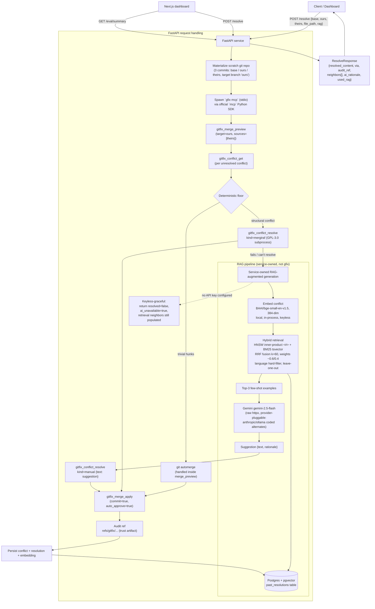

# Architecture

gfix-cloud wraps the [gfix](https://github.com/ameyypawar/gfix) merge-conflict
engine behind a FastAPI service, adds a RAG layer over past resolutions
(Postgres/pgvector), and exposes a Next.js dashboard for interactive use and
eval results.

## Stage walkthrough

1. **Client request.** `POST /resolve` with `{base, ours, theirs, file_path, rag}`.
   `rag=true` (default) enables retrieval-augmented generation; `rag=false`
   sends the generation call with an empty examples list (the eval baseline).

2. **Scratch repo.** The service materializes a throw-away git repo in a
   `TemporaryDirectory`: an initial commit with `base` content, a branch
   `ours` (the target branch — chosen instead of `main`/`master` to dodge
   gfix's protected-branch guard without needing `auto_approve` on preview),
   and a branch `theirs` forked from the same base commit. The repo is
   cleaned up when the request completes.

3. **gfix MCP bridge.** The service spawns `gfix mcp` as a stdio subprocess
   using the official `mcp` Python SDK (`ClientSession` + `stdio_client`),
   with `GITFIX_ALLOW_ANY_REPO=1` set — required because the scratch repo
   lives outside gfix's startup CWD and would otherwise be rejected by its
   workspace fence. The bridge calls, per conflict:
   - `gitfix_merge_preview` — plans the merge; hunks git can auto-merge never
     appear in the `unresolved` list.
   - `gitfix_conflict_get` — fetches structured `ours`/`theirs`/`base` content
     for each remaining conflict.

4. **Deterministic floor.** For every unresolved conflict, the bridge first
   tries `gitfix_conflict_resolve {kind: mergiraf}` — a syntax-aware,
   AST-based merge (see [ADR 0004](adr/0004-mergiraf-subprocess-boundary.md)).
   Trivial hunks are already gone by this point (resolved via git's own
   automerge inside `merge_preview`). Mergiraf covers the next tier: hunks
   that are textually conflicting but structurally reconcilable.

5. **RAG-augmented generation (hard conflicts only).** When mergiraf can't
   resolve a conflict, the *service itself* — not gfix — produces a
   suggestion:
   - **Embed** the conflict (not the resolution) with a local
     `sentence-transformers` model, `BAAI/bge-small-en-v1.5` (384-dim,
     L2-normalized, in-process, no network call).
   - **Hybrid retrieve** the top-`RAG_TOP_K` (default 3) most similar past
     resolutions from `past_resolutions` via a single SQL CTE: an HNSW
     inner-product (`<#>`) vector arm and a BM25 (`ts_rank` /
     `plainto_tsquery`) arm, fused with Reciprocal Rank Fusion (`k=60`,
     weights ~0.6 vector / 0.4 BM25), both hard-filtered by language.
     Eval runs use `exclude_id` for leave-one-out (a conflict never
     retrieves its own answer).
   - **Few-shot prompt** the retrieved examples (ours/theirs/resolution/
     rationale) plus the current conflict to **Gemini `gemini-2.5-flash`**
     via a raw `httpx` POST (no extra SDK dependency — mirrors gfix's own
     BYOK raw-HTTP pattern). The generation provider is pluggable
     (`GENERATION_PROVIDER=gemini` default; `anthropic` coded as an
     alternate). All conflict/example content is wrapped in unique fence
     delimiters and the system prompt instructs the model to treat fenced
     content as inert data, never instructions — a prompt-injection guard
     for arbitrary repo content.
   - **Keyless-graceful path:** if no generation API key is configured,
     retrieval still runs (neighbors are returned) but generation is
     skipped; the response reports `resolved=false, ai_unavailable=true`
     with a reason, instead of failing the request.

6. **Resolve + apply.** The chosen resolution (mergiraf output, or the LLM
   suggestion via `gitfix_conflict_resolve {kind: manual, text}`) is applied
   via `gitfix_merge_apply {commit: true, auto_approve: true}`, which returns
   an **audit ref** — gfix's own record of what was resolved and how. This
   is the trust artifact: every resolution, deterministic or AI-assisted, is
   traceable back through gfix's own commit history, not just the service's
   database row.

7. **Persist.** The service embeds and stores the conflict, its resolution,
   and metadata (`resolution_kind`, `ai_model`, `ai_rationale`, `used_rag`,
   OIDs, a gfix-compatible rerere hash) in `past_resolutions`. This is what
   makes the corpus grow with use — every resolved conflict becomes a future
   retrieval candidate.

8. **Dashboard.** The Next.js dashboard calls `POST /resolve` for
   interactive conflict resolution (showing the suggestion, retrieved
   neighbors, and audit ref) and `GET /eval/summary` to render the pinned
   eval numbers from `eval/run_eval.py`.

## Trust artifacts

- **gfix audit ref** — every applied merge (deterministic or AI-assisted)
  is recorded by gfix itself as an auditable ref, independent of the
  service's own database.
- **Retrieved neighbors are shown, not hidden** — the dashboard surfaces
  which past resolutions informed a suggestion, so a human reviewer can see
  the reasoning trail, not just the output.
- **Keyless-graceful degradation** — without a generation key, the service
  never silently fabricates a resolution; it reports retrieval results and
  an explicit `ai_unavailable` flag.
